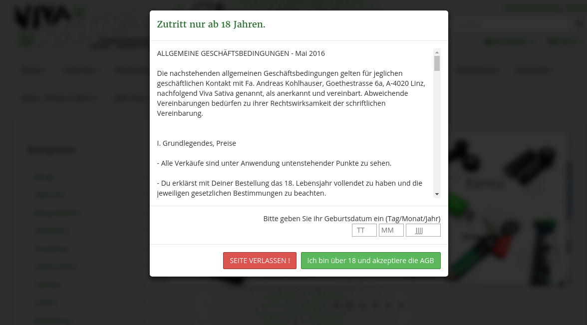
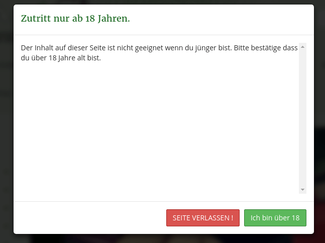

# JTL Shop4 Plugin - FSK Landing Warning

- [JTL Shop4 Plugin - FSK Landing Warning](#jtl-shop4-plugin---fsk-landing-warning)
  - [Features](#features)
  - [Installation](#installation)
  - [Anleitung](#anleitung)
    - [Einstellungen](#einstellungen)
    - [Exportformate verwenden](#exportformate-verwenden)
      - [Variante 1 via FTP](#variante-1-via-ftp)
      - [Variante 2 via HTACCESS](#variante-2-via-htaccess)
  - [Vorschau](#vorschau)
    - [Demo](#demo)
    - [Screenshots](#screenshots)
  - [Geplante Features](#geplante-features)
  - [Unterstützen](#unterst%C3%BCtzen)

Es handelt sich hier um ein simples Plugin welches als FSK Warnung hergenommen werden kann. Es wird je nach Einstellung ein Dialog oder eine Landing Page angezeigt wo der User per Button sein Alter zuerst bestätigen muss bevor er den Shop betreten kann. Optional kann eine Geburtsdatum Eingabe erzwungen werden.

## Features

- Warnung als Dialog oder Landing Page
- Anzeigen der AGB oder von eigenem Text durch Sprachvariable
- Optionale erforderliche Eingabe von Geburtsdatum
- Link URL wenn Benutzer ablehnt
- Senden von "content-age" und/oder "age-hash" header
- Einfügen von "content-age" meta tag
- Exportformat als "age.xml", "age-de.xml" und "miracle.xml"

## Installation

Gehen Sie auf der Github Seite auf "Releases" und laden Sie die letzte Version herunter. Diese können Sie im Shop Backend unter Plugin Verwaltung hochladen, installieren und/oder aktualisieren.

## Anleitung

Sobald das Plugin installiert ist müssen Sie noch in den Einstellungen von diesem Plugin die benötigten Optionen aktivieren.

### Einstellungen

Siehe [SETTINGS.md](SETTINGS.md).

### Exportformate verwenden

Das Plugin stellt Exportformate für age.xml, age-de.xml und miracle.xml bereit. Nähere Infos dazu findet man unter [age-label.de](http://www.age-label.de) und [miracle-label.eu](https://www.miracle-label.eu).

Um die Exportformate zu verwenden gibt es zwei Möglichkeiten

#### Variante 1 via FTP

1. Erstellen des Exportformats im Admin Bereich unter "System > Exportformate"
2. Herunterladen des jeweillig erstellten Exportformat.
3. Hochladen der Datei in das Root-Verzeichniss des Shops per FTP. _dieser Schritt ist notwendig weil in diesem Verzeichniss nicht zwingend Schreibrechte vorhanden sein müssen und daher dass Plugin diesen Schritt nicht automatisch erledigen kann._

#### Variante 2 via HTACCESS

1. Erstellen Sie alle für Sie benötigten Exportformate
2. Fügen Sie eine Weiterleitung in die .htaccess Datei ein, gleich wie es auch bei der sitemap.xml gemacht wird.

Hier noch ein Beispiel wie die Weiterleitung in der .htaccess aussehen sollte:

```apache
<IfModule mod_rewrite.c>
  # Suchen Sie nach dieser Zeile..
  RewriteEngine on

  # ... und fügen sie danach folgende Zeilen ein
  RewriteCond %{REQUEST_FILENAME} !-f
  RewriteCond %{REQUEST_FILENAME} !-d
  # Redirect für age.xml und age-[country].xml
  RewriteRule ^age([_\-]?[a-z]*)\.xml$ export/age$1.xml [L]
  # Redirect für miracle.xml
  RewriteRule ^miracle\.xml$ export/miracle.xml [L]
</IfModule>
```

## Vorschau

### Demo

Einen Demo Shop wo das Plugin aktiv in Verwendung ist findet man unter [shop.vivasativa.at](https://shop.vivasativa.at)

### Screenshots

| Landing Page | Dialog | Dialog simpel |
|-|-|-|
| [](.files/screen01.png) | [](.files/screen02.png) | [](.files/screen03.png) |

## Geplante Features

- [ ] Regional spezifische age.xml durch verknüpfen von age-[country].xml
- [ ] JTL Wawi Attribut gesteuerte Ausgabe von x-content-age Header und content-age Meta Tag

## Unterstützen

Falls ihr mir was als BTC o.ä. spenden wollt, könnt ihr dass auf folgende Adressen tun:

- Bitcoin (BTC): 19FXuMSR1yoApqZ9VkY1e8bhxHp4fqK4ZB
- Ether (ETC): 0x45dAC2c1647B505Dc3a4E48FAa3443bbEAf6eBF2
- Bitcoin Cash (BTH): qpdgpgp78r5ql8c9tjtkc4ex82s09hc4a5tsralx4g
